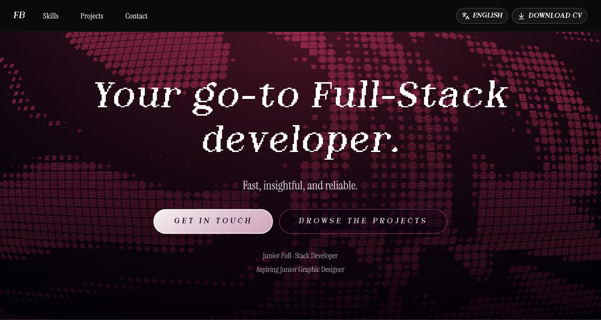

# FB's Portfolio

Single-page developer portfolio built with React, Vite, and a feature-based architecture. It highlights Hero, Skills, Projects, and Contact sections with smooth GSAP-powered transitions, localized copy (EN/IT - which defaults to IT), and curated UI components inspired by shadcn/ui and the Faulty Terminal shader from React Bits.



## 🧭 Overview
- **Modern stack**: React 19, TypeScript, Vite 7, Tailwind CSS 4, GSAP, Framer Motion, i18next, and Radix primitives.
- **Feature-first structure**: UI sections live under `src/features/*` with shared utilities, hooks, and i18n helpers in `src/shared/*`.
- **Enhanced animations**: GSAP SmoothScroller + custom FaultyTerminal background render dynamic motion without sacrificing performance.
- **Internationalization**: copy lives in `src/shared/i18n`, supporting English and Italian out of the box.
- **Component library**: reusable shadcn/ui-inspired primitives live under `src/components/ui` for consistent design.

## ⚙️ Prerequisites
- Node.js **18 LTS** or newer (aligns with Vite and modern React requirements).
- npm 9+ (alternatively, adapt the commands for pnpm/yarn if preferred).

## 🚀 Getting started
1. Install dependencies:
	 ```bash
	 npm install
	 ```
2. Start the development server:
	 ```bash
	 npm run dev
	 ```
	 The app runs on [http://localhost:5173](http://localhost:5173) by default.

### Other scripts
- Type-check & production bundle:
	```bash
	npm run build
	```
- Preview the production build locally:
	```bash
	npm run preview
	```
- Lint / format with Biome:
	```bash
	npm run lint
	npm run format
	```

## 🗂️ Project structure highlights
```
src/
	features/            # Feature modules (hero, skills, projects, contact)
		hero/
			components/FaultyTerminal.tsx
	components/
		ui/                # shadcn-inspired primitives
		ScrollTopButton.tsx              # arrow component at the end of the page
	shared/
		hooks/             # e.g. use-section-reveal
		lib/               # gsap, scroll helpers, cn utility
		i18n/              # i18next config + resources
	assets/              # (kept for legacy, fonts served from public/fonts)
public/fonts/          # Dotemp 8-bit, Instrument Serif assets
```

## 🌐 Internationalization
- Language resources are defined in `src/shared/i18n/resources.ts` with the language enum and translation JSON.
- Runtime config lives in `src/shared/i18n/config.ts`. `src/main.tsx` wires the i18next instance through `I18nextProvider`.
- To add a language:
	1. Extend the `resources` object with the new locale key and strings.
	2. Update the `AppLanguage` union and `defaultLanguage` if needed.
	3. Surface the language in the navbar toggler (see `LANGUAGES` array in `Navbar`).

## 🧱 Animations & visuals
- Smooth scrolling is orchestrated via `src/shared/lib/gsap.ts`, registering `ScrollSmoother` on mount in `App.tsx`.
- The FaultyTerminal hero background lives in `src/features/hero/components/FaultyTerminal.tsx` and renders an OGL shader ported from React Bits.
- Tailwind CSS 4 provides utility-first styling with a custom index stylesheet that sets up fonts and global tokens.

## 📦 Environment & data
- No external services or API keys are required; all content is static.
- Fonts are served from `/public/fonts` and referenced in `src/index.css`.
- Section content (skills, projects, contact links) is hard-coded in the respective feature modules and can be edited there.

## 🛠️ Future improvements
- **Content CMS**: expose projects/skills via JSON or headless CMS for non-technical updates.
- **Automated testing**: add unit tests (Vitest/React Testing Library) and visual regression coverage for key components.
- **Accessibility audit**: run tooling (axe, Lighthouse) to refine keyboard navigation and contrast.
- **Deployment workflow**: add CI to lint, test, and deploy to a static host (Github Pages?)
- **Code splitting**: tackle the large bundle warning by lazy-loading animation-heavy sections.

## 📚 References & inspiration
- Faulty Terminal background: [React Bits – Faulty Terminal](https://www.reactbits.dev/backgrounds/faulty-terminal)
- Navbar pattern: [shadcn/ui – Navbar 01](https://www.shadcn.io/components/navbar/navbar-01)
- Terminal component: [shadcn/ui – Terminal](https://www.shadcn.io/components/visualization/terminal#basic-terminal)
- Animations: [GSAP Official Docs](https://gsap.com/docs/v3/)
- Internationalization: [i18next Documentation](https://www.i18next.com/)

Feel free to reach out or open a PR if you extend the portfolio—happy building!